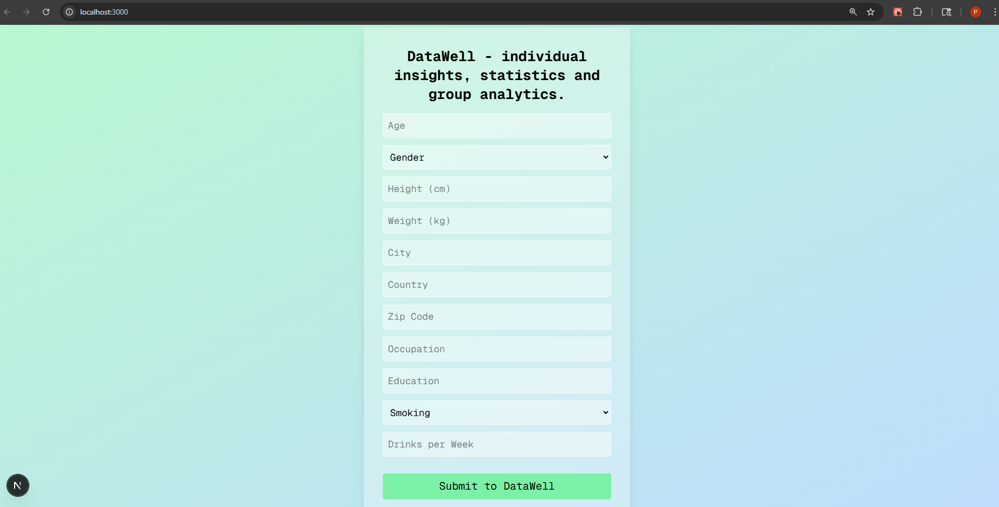
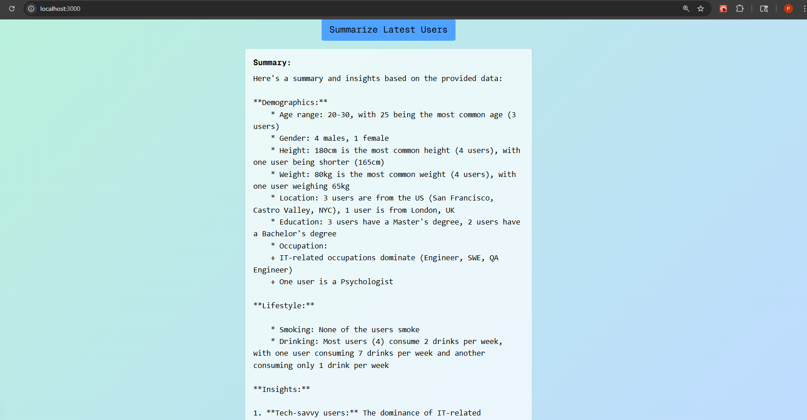

# DataWell

**DataWell** is a modern web application for collecting, storing, and analyzing user demographic and lifestyle data. It provides instant, AI-powered summaries and insights about your user base, making it easy to understand trends and patterns in your data.

---

## Page Descriptions and Sample Screenshots
### Home Page




##  Features

- **User-Friendly Form:** Collects detailed demographic, location, occupation, education, and lifestyle data from users.
- **Database Integration:** Securely stores all submissions in a Neon (PostgreSQL) database using Drizzle ORM.
- **AI-Powered Summaries:** Instantly generates readable summaries and insights using the Groq API (Llama 3 model).
- **Live Analytics:** Summarize the latest user data at any time with a single click.
- **Modern UI:** Clean, responsive interface built with React and Tailwind CSS.

---

##  Technology Stack

- **Frontend:** Next.js (React), TypeScript, Tailwind CSS
- **Backend:** Next.js API Routes
- **Database:** Neon (PostgreSQL) with Drizzle ORM
- **AI Summarization:** Groq API (Llama 3)
- **Deployment:** Ready for Vercel or any Node.js hosting

---

##  How It Works

1. **User submits data** via a simple, intuitive form.
2. **Data is saved** to the Neon database.
3. **Summarize button** fetches the latest user data and sends it to the Groq API.
4. **Groq API** returns a human-readable summary and insights, displayed instantly on the page.

---

##  Setup & Usage

1. **Clone the repository**
2. **Install dependencies**
   ```
    npm install next react react-dom

    npm install drizzle-orm @drizzle-orm/postgres-js @neondatabase/serverless

    npm install uuid

    npm install tailwindcss postcss autoprefixer
    
    npm install dotenv

    npm install --save-dev typescript @types/react @types/node
   ```
3. **Configure environment variables** in `.env.local`:
   ```
   DATABASE_URL=your_neon_connection_string
   GROQ_API_KEY=your_groq_api_key
   ```
4. **Run the development server**
   ```sh
   npm run dev
   ```
5. **Open [http://localhost:3000](http://localhost:3000)** in your browser.

---

##  Example Use Cases

- Team or community demographic analytics
- Health and lifestyle data collection
- Instant group insights for research

---

 **Pavlo Sernetskyi** 
- [Link to Github](https://github.com/PavloSernetskyi)
- [Link to LinkedIn](https://www.linkedin.com/in/pavlo-sernetskyi)


**Made with Next.js, Neon, Drizzle, and Groq AI**